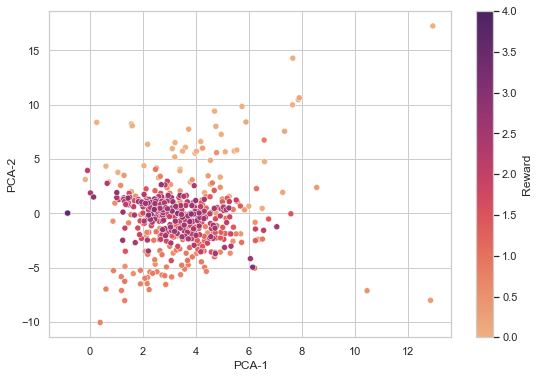
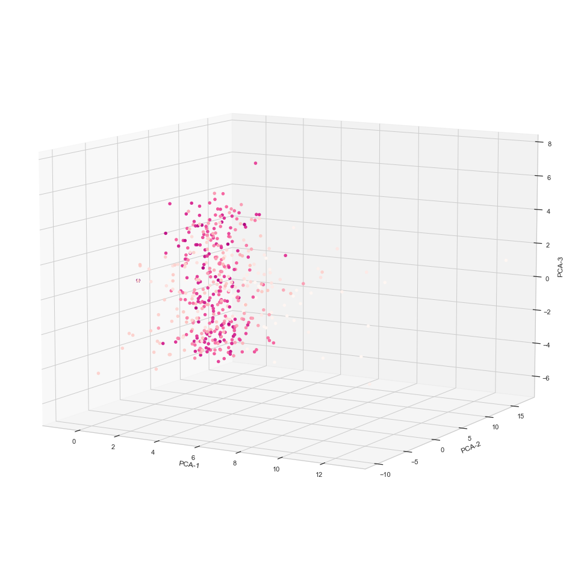
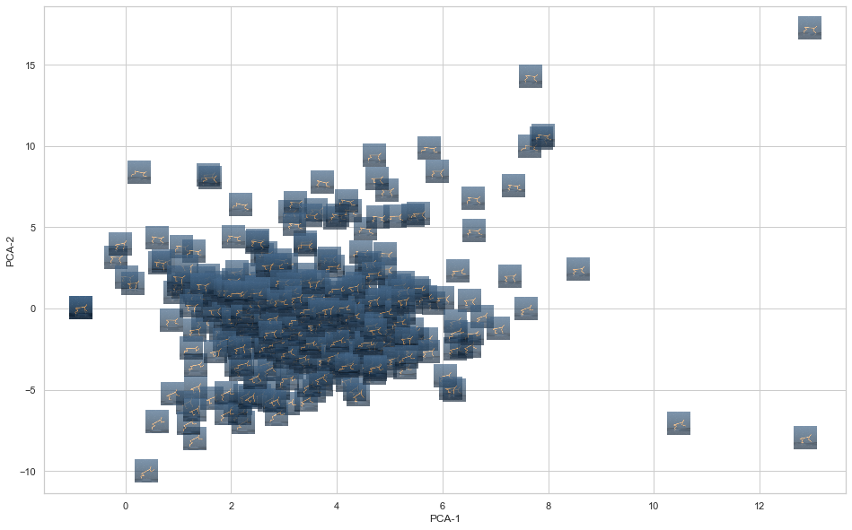
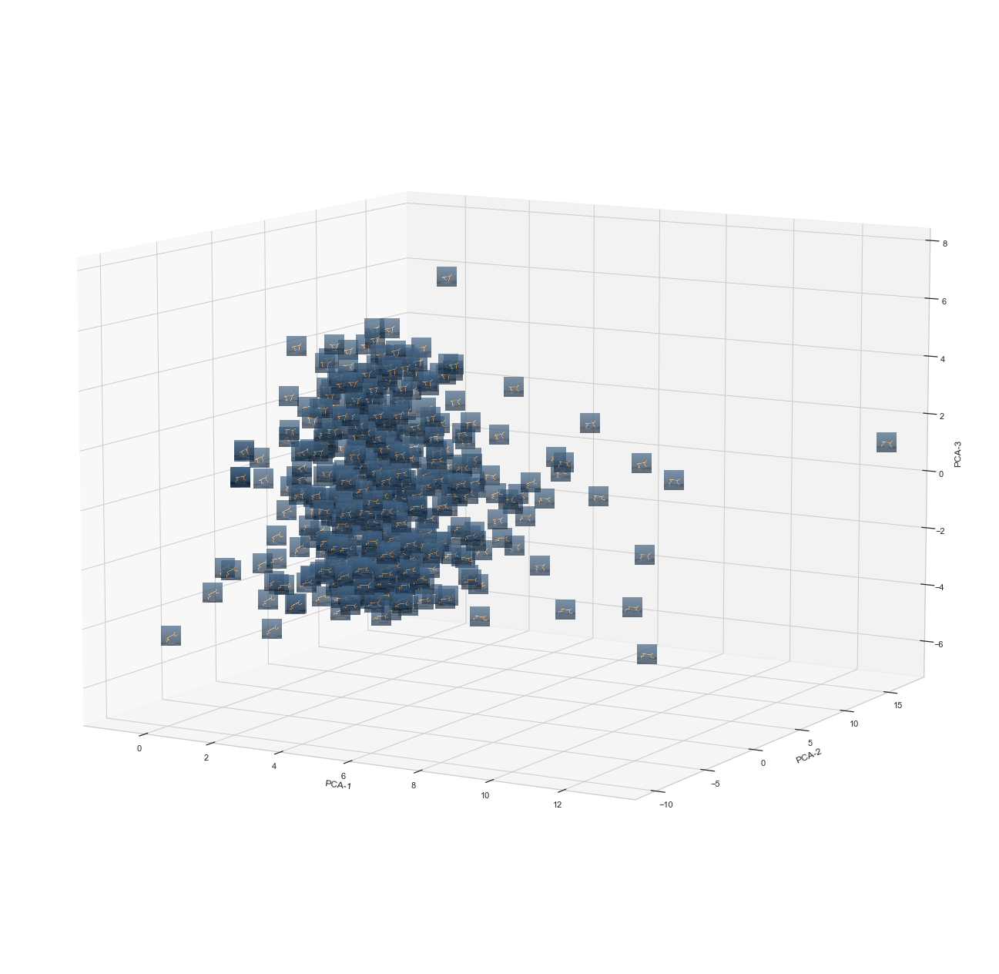

# Latent Space Plots
A simple Jupyter notebook to visualize data in latent space using dimensionality reduction techniques. The notebook focuses on RL with image-based observations.

## Data basis
Latent vectors and rewards: (n, k + 1)

| Index         | Feature_0         | Feature_1         | Feature_2         | Feature_k         | Reward            |
| ------------- |:-----------------:|:-----------------:|:-----------------:|:-----------------:|:-----------------:|
| 0             | ...               | ...               | ...               | ...               | ...               |
| 1             | ...               | ...               | ...               | ...               | ...               |
| 2             | ...               | ...               | ...               | ...               | ...               |
| n             | ...               | ...               | ...               | ...               | ...               |

Corresponding images: (n, 3, 64, 64)

## Dimensionality reduction options
- Principal Component Analysis (PCA)
- t-Distributed Stochastic Neighbor Embedding (TSNE)

## Visualizations
### 2D plot

### 3D plot

### 3D animation

### 2D plot with images

### 3D plot with images

### 3D animation with images
